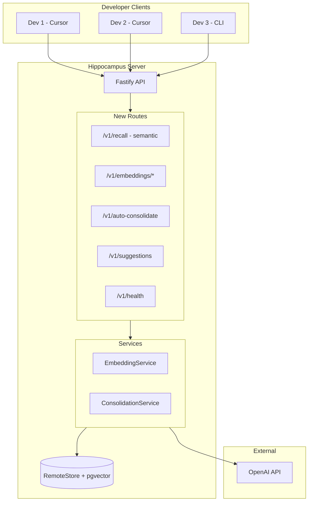

# Server-Side AI Features for Teams

This plan adds centralized AI capabilities to the Hippocampus server, allowing a team lead to run semantic search and auto-consolidation for the entire team using a single OpenAI API key.

## Architecture




## Phase 1: RemoteStore Methods

Add missing methods to [src/db/remote.ts](src/db/remote.ts) that exist in LocalStore:

- `findSimilar(query)` - Find similar memories using FTS or embeddings
- `consolidateMemories(input)` - Create consolidated memory from sources
- `list(query)` - Already exists, verify it matches LocalStore signature

## Phase 2: Semantic Recall Endpoint

Update [src/server/routes/recall.ts](src/server/routes/recall.ts):

```typescript
app.post("/v1/recall", async (request, reply) => {
  // Parse query
  // If OPENAI_API_KEY is set, generate query embedding
  // Call store.recallWithEmbeddings() for hybrid search
  // Fall back to FTS if no key
});
```

## Phase 3: Embedding Routes

Create [src/server/routes/embeddings.ts](src/server/routes/embeddings.ts):


| Endpoint                            | Method | Description                                      |
| ----------------------------------- | ------ | ------------------------------------------------ |
| `/v1/embeddings/generate/:memoryId` | POST   | Generate embedding for specific memory           |
| `/v1/embeddings/backfill`           | POST   | Generate embeddings for all memories without one |
| `/v1/embeddings/stats`              | GET    | Get embedding coverage statistics                |


## Phase 4: Auto-Embedding Hook

Modify [src/db/remote.ts](src/db/remote.ts) `store()` method:

```typescript
async store(input: CreateMemoryInput): Promise<Memory> {
  const memory = await this.createMemory(input);
  
  // Auto-generate embedding if OpenAI key is available
  if (isOpenAIConfigured()) {
    this.generateAndStoreEmbedding(memory.id, memory.text).catch(console.error);
  }
  
  return memory;
}
```

## Phase 5: Auto-Consolidation

Create [src/core/auto-consolidate-remote.ts](src/core/auto-consolidate-remote.ts) - Adapted version for RemoteStore:

- `findConsolidationCandidatesRemote(store, orgId, repoId, options)`
- `executeConsolidationRemote(store, candidate, orgId, repoId, options)`

Create [src/server/routes/auto-consolidate.ts](src/server/routes/auto-consolidate.ts):


| Endpoint                       | Method | Description                                     |
| ------------------------------ | ------ | ----------------------------------------------- |
| `/v1/auto-consolidate/preview` | POST   | Find consolidation candidates without executing |
| `/v1/auto-consolidate`         | POST   | Find and execute consolidation with LLM         |
| `/v1/auto-consolidate/execute` | POST   | Execute specific candidate group                |


## Phase 6: Suggestions & Health

Create [src/server/routes/suggestions.ts](src/server/routes/suggestions.ts):

```typescript
GET /v1/suggestions?orgId=x&repoId=y
// Returns: add_tags, add_links, consolidate, deprecate, generate_embedding suggestions
```

Create [src/server/routes/health.ts](src/server/routes/health.ts):

```typescript
GET /v1/health/repo?orgId=x&repoId=y
// Returns: overall score, embedding coverage, consolidation ratio, stale count
```

## Phase 7: Server Configuration

Update [.env.example](.env.example):

```bash
# Server-side AI (optional - enables semantic search for all users)
OPENAI_API_KEY=sk-...

# Auto-embedding: generate embeddings when memories are created
AUTO_EMBEDDING_ENABLED=true

# LLM model for consolidation (default: gpt-4o-mini)
CONSOLIDATION_MODEL=gpt-4o-mini
```

## Phase 8: Register Routes

Update [src/server/index.ts](src/server/index.ts):

```typescript
import { embeddingRoutes } from "./routes/embeddings.js";
import { autoConsolidateRoutes } from "./routes/auto-consolidate.js";
import { suggestionsRoutes } from "./routes/suggestions.js";
import { healthRoutes } from "./routes/health.js";

// Register new routes
await embeddingRoutes(app, store);
await autoConsolidateRoutes(app, store);
await suggestionsRoutes(app, store);
await healthRoutes(app, store);
```

## Phase 9: Documentation

Update:

- [README.md](README.md) - Add "Server-Side AI" section
- [website/app/docs/page.tsx](website/app/docs/page.tsx) - Add server deployment docs
- [website/components/features.tsx](website/components/features.tsx) - Highlight team features

## Files to Create


| File                                    | Description                                |
| --------------------------------------- | ------------------------------------------ |
| `src/server/routes/embeddings.ts`       | Embedding generation endpoints             |
| `src/server/routes/auto-consolidate.ts` | Auto-consolidation endpoints               |
| `src/server/routes/suggestions.ts`      | Curation suggestions endpoint              |
| `src/server/routes/health.ts`           | Repository health endpoint                 |
| `src/core/auto-consolidate-remote.ts`   | RemoteStore-compatible consolidation logic |


## Files to Modify


| File                          | Changes                                                   |
| ----------------------------- | --------------------------------------------------------- |
| `src/db/remote.ts`            | Add `findSimilar`, `consolidateMemories`, auto-embed hook |
| `src/server/routes/recall.ts` | Add semantic search with embeddings                       |
| `src/server/index.ts`         | Register new routes                                       |
| `src/core/embeddings.ts`      | Already has `isOpenAIConfigured()`                        |
| `.env.example`                | Add new config vars                                       |
| `README.md`                   | Document server-side AI                                   |
| `website/`                    | Update docs and features                                  |


