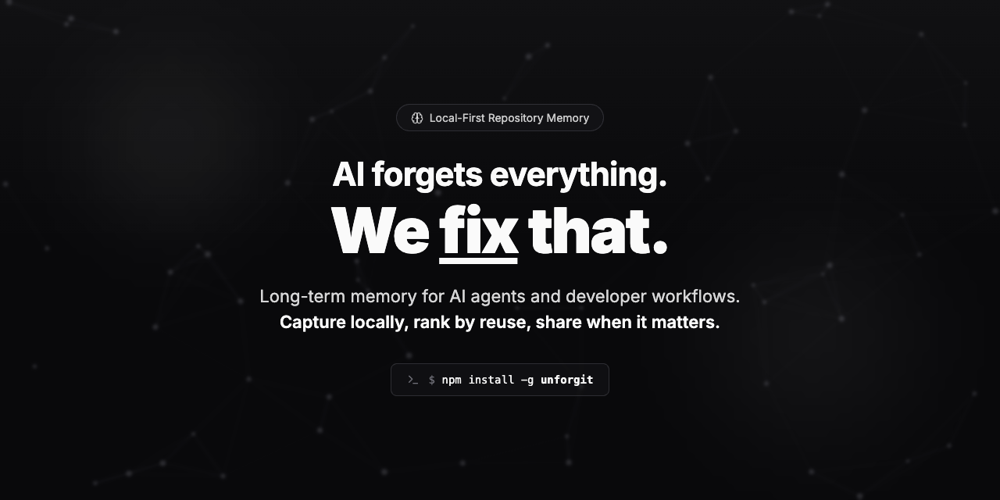

<p align="center">
  
</p>

<h1 align="center">Unforgit</h1>

<p align="center">
  <strong>Long-term memory for AI agents and developer workflows.</strong><br>
  Capture locally, rank by reuse, share when it matters.
</p>

<p align="center">
  <a href="https://www.npmjs.com/package/unforgit"></a>
  <a href="https://github.com/MiguelMedeiros/unforgit/releases/latest"></a>
  <a href="LICENSE"></a>
  <a href="https://github.com/MiguelMedeiros/unforgit"></a>
</p>

<p align="center">
  <code>npm install -g unforgit</code>
</p>

---

## Quick Start

```bash
# Initialize in any repo
unforgit init

# Save a memory
unforgit add "We use UTC timestamps everywhere" --type semantic --tags "convention"

# Recall by meaning
unforgit recall "how to deploy" --types procedural,semantic --k 5

# Bridge markdown memory files used by coding agents
unforgit md import CLAUDE.md --dry-run
unforgit md export --format claude --out CLAUDE.md

# Open the local memory dashboard
unforgit dashboard
```

## Documentation

| Topic | Description |
|-------|-------------|
| [Concepts](docs/concepts.md) | Memory types, scopes, statuses, visibility policy, lifecycle |
| [CLI Reference](docs/cli.md) | All CLI commands — add, recall, templates, curate, merge, sync |
| [Configuration](docs/configuration.md) | Local-first embeddings, optional OpenAI, authentication, sync settings, YAML config |
| [API Server](docs/api.md) | HTTP API setup, endpoints, request examples |
| [Server-Side AI](docs/server-ai.md) | Team mode with server-side OpenAI integration |
| [MCP Server](docs/mcp.md) | Cursor IDE integration via Model Context Protocol |
| [Agent Tools](docs/agent-tools.md) | Programmatic TypeScript interface |
| [Architecture](docs/architecture.md) | Project structure, semantic search, development |

## Development

```bash
pnpm dev:server    # Start API server with hot reload
pnpm dev:cli       # Run CLI in dev mode
pnpm build         # Build for production
pnpm test          # Run tests
```

